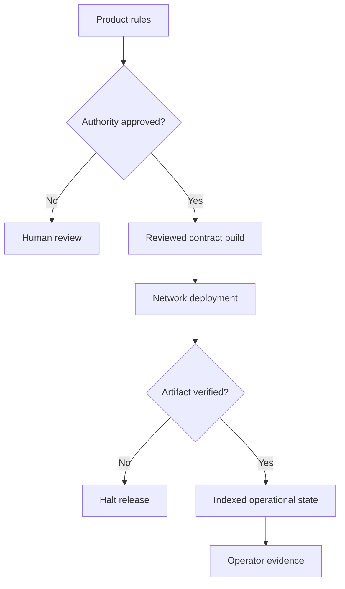

[← J0UH profile](https://github.com/J0UH)

  

# Stablecoin and programmable asset infrastructure

The same programmable-asset foundation can represent fiat-linked money, precious metals, energy, agricultural commodities, and other capital-market products. I have worked across the contracts, authority, deployment, verification, metadata, indexing, vaults, settlement, interfaces, audit work, and operating controls that turn those assets into usable systems.

## The engineering problem

A token contract is a component, not a financial product. The difficult work sits between the meaning of the asset, on-chain rules, and off-chain responsibility: who has authority, what backs the asset, which artifact was deployed, how state is observed, and how exceptions are handled.

## Systems and project pages

| Project | What it covers |
| --- | --- |
| [Programmable asset issuance](https://github.com/J0UH/stablecoin-factory) | Controlled issuance workflows for stable-value money, commodities, precious metals, and other tokenised assets. |
| [Digital cash platform](https://github.com/J0UH/digital-cash-platform) | Programmable digital cash contracts, controls, audit preparation, and operational delivery. |
| [Vault and liquidity systems](https://github.com/J0UH/vault-liquidity-systems) | Vault workflows, liquidity state, indexed events, and operator-facing calculations. |
| [Always-on blockchain settlement](https://github.com/J0UH/token-bridge-sdk) | Same-chain and cross-chain settlement, atomic exchange, integration surfaces, finality, and fiat reconciliation. |
| [Asset-backed product interfaces](https://github.com/J0UH/asset-backed-products) | Customer-facing gold and stable-value products built on top of deeper financial infrastructure. |
| [Stablecoin as a service](https://github.com/J0UH/stablecoin-service-platform) | Multi-tenant issuance, administration, integration, and lifecycle operations. |
| [Smart contract operations](https://github.com/J0UH/smart-contract-operations) | Contract verification, token metadata, integration lists, testing, and operational release support. |

## How the pieces fit

## Principles that carry across the work

- Make privileged authority explicit and reviewable.
- Tie deployed artifacts back to a reviewed build.
- Separate contract state from derived operational state.
- Treat audit preparation and release evidence as engineering work.
- Simplify the interface without simplifying away the truth.

Public overview only. Source code, customer data, credentials, and private operating details are not included.

## Talk through a similar problem

Working on something similar? [Tell me about it](mailto:ju@jomena.group?subject=Stablecoin%20and%20programmable%20asset%20infrastructure).
