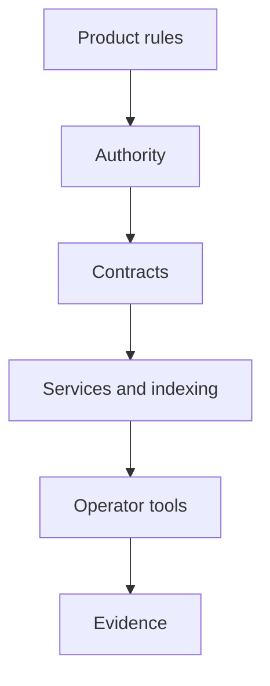

  

# Stablecoin infrastructure

I have spent years turning token contracts into systems that people can issue, integrate, operate, review, and support. That includes contracts, authority, deployment, verification, metadata, indexing, SDKs, vaults, bridges, product interfaces, audit work, and the less glamorous controls that keep all of it coherent.

[Reach out](mailto:ju@jomena.group?subject=Discuss%20Stablecoin%20infrastructure) | [Book a technical call](mailto:ju@jomena.group?subject=Book%20a%20technical%20call%20about%20Stablecoin%20infrastructure)

## The engineering problem

A token contract is a component, not a financial product. The difficult work sits between on-chain rules and off-chain responsibility: who has authority, which artifact was deployed, how state is observed, how exceptions are handled, and how operators know what they are allowed to do.

## Systems and project pages

| Project | What it covers |
| --- | --- |
| [Stablecoin factory](https://github.com/J0UH/stablecoin-factory) | Issuance workflows, contract deployment, metadata, verification, and operator controls. |
| [Digital cash platform](https://github.com/J0UH/digital-cash-platform) | Programmable digital cash contracts, controls, audit preparation, and operational delivery. |
| [Vault and liquidity systems](https://github.com/J0UH/vault-liquidity-systems) | Vault workflows, liquidity state, indexed events, and operator-facing calculations. |
| [Token bridge and SDK](https://github.com/J0UH/token-bridge-sdk) | Cross-network token movement, integration SDKs, deployment support, and verification. |
| [Asset-backed product interfaces](https://github.com/J0UH/asset-backed-products) | Customer-facing gold and stable-value products built on top of deeper financial infrastructure. |
| [Stablecoin as a service](https://github.com/J0UH/stablecoin-service-platform) | Multi-tenant issuance, administration, integration, and lifecycle operations. |
| [Smart contract operations](https://github.com/J0UH/smart-contract-operations) | Contract verification, token metadata, integration lists, testing, and operational release support. |

## How the pieces fit

## Principles that carry across the work

- Make privileged authority explicit and reviewable.
- Tie deployed artifacts back to a reviewed build.
- Separate contract state from derived operational state.
- Treat audit preparation and release evidence as engineering work.
- Simplify the interface without simplifying away the truth.

Built under the Aryze umbrella. The underlying source and company IP remain private and owned by Aryze. Delivery involved people across engineering, product, operations, compliance, and design. Open-source foundations retain their original attribution and licences.

## Talk through a similar problem

[Tell me what you are building](mailto:ju@jomena.group?subject=I%20am%20building%20something%20in%20Stablecoin%20infrastructure) or [book a technical call](mailto:ju@jomena.group?subject=Book%20a%20technical%20call%20about%20Stablecoin%20infrastructure). A fuller portfolio site is in preparation.
